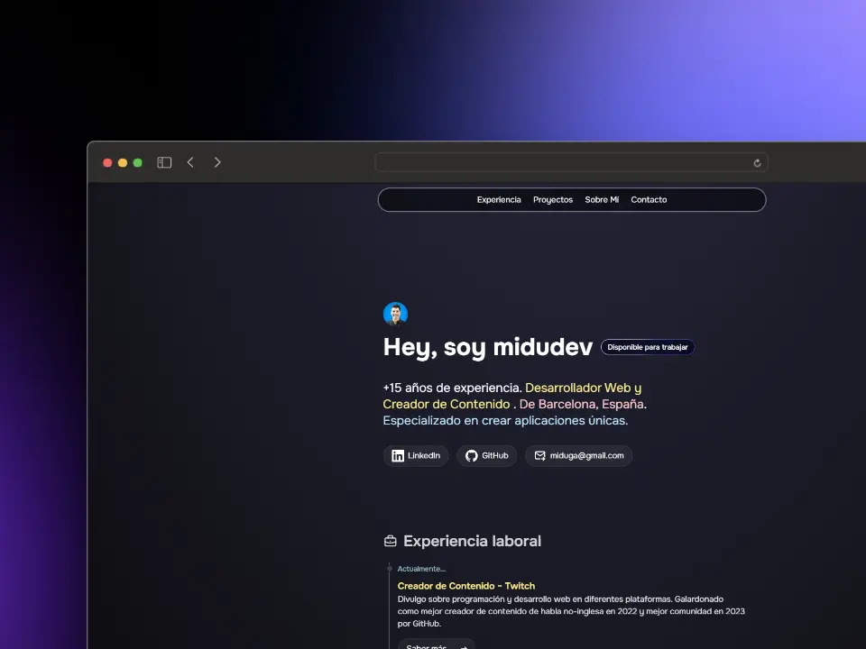

# Portfolio de Carlos Hernández Martínez

<div align="center">
  
  <p></p>
</div>

<div align="center">

  
  
  
  

</div>

Portfolio personal desarrollado con Astro y Tailwind, desplegado en Cloudflare Pages. Incluye una app principal para presentar experiencia y proyectos, y una subaplicación de finanzas en `/finanzas/` con persistencia en Cloudflare KV y utilidades de análisis.

## Scripts

```bash
npm run dev
npm run build
npm run preview
```

## Estructura del proyecto

```text
src/
├── components/        # UI del portfolio principal
├── data/              # CV, traducciones y registros estáticos
├── layouts/           # Plantillas Astro
├── pages/             # Páginas y APIs serverless
└── utils/             # i18n, chat local y utilidades compartidas
public/
└── finanzas/          # App standalone de finanzas en Vanilla JS
```
