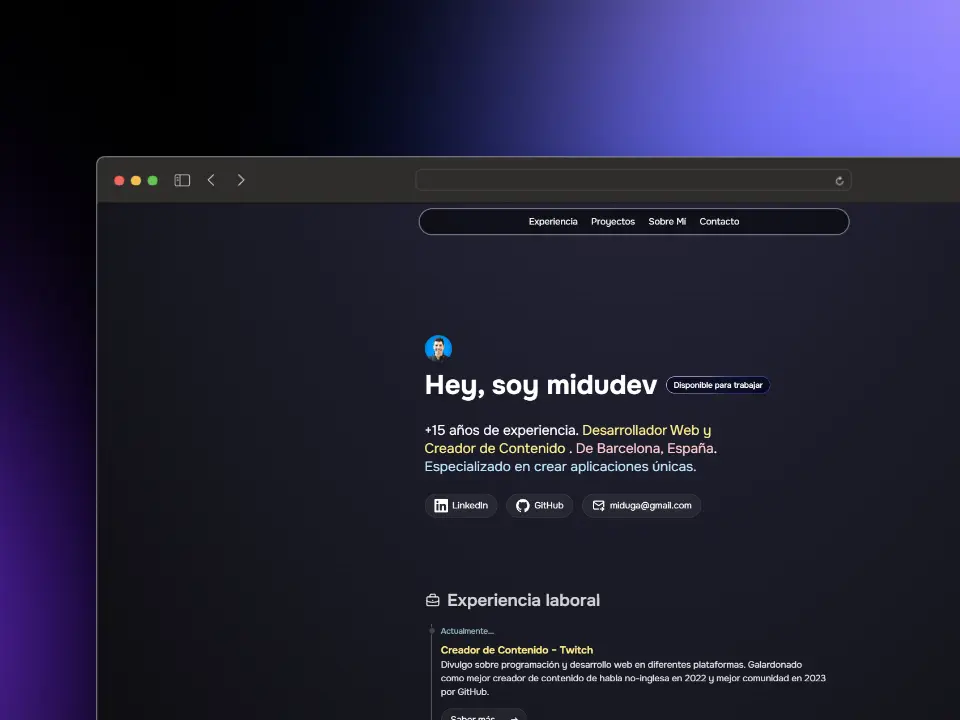

# 👨🏻‍💻 Porfolio de Carlos Hernández Martínez

<div align="center">
  <a href="https://porfolio.dev/">
    
  </a>
  <p></p>
</div>

<div align="center">

  
  
  
  
  
  

</div>

🔗 [GitHub del portfolio original](https://github.com/midudev/porfolio.dev)

👨🏽‍💻 [Perfil de Midudev](https://github.com/midudev)

## Estructura del proyecto

```text
src/
├── components/
│   ├── icons/      # Iconos reutilizables
│   ├── layout/     # Componentes de cabecera y pie de página
│   ├── sections/   # Secciones de la web (AboutMe, Projects, ...)
│   └── ui/         # Componentes de interfaz reutilizables
├── data/           # Datos estáticos
├── layouts/        # Plantillas de página
└── pages/          # Rutas de la aplicación
```
